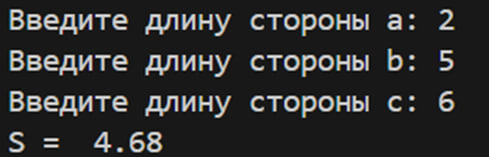
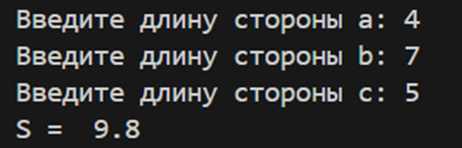
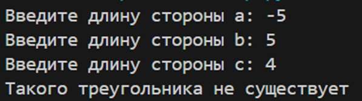

#Исполнитель
# Исполнитель

Козыренко Вячеслав Николаевич
Группа Фт-240008  

# Лабораторная работа №1 – Функции ввода/вывода, условный оператор

Написать программу, которая вычисляет площадь треугольника по трём его сторонам (по формуле Герона) с точность до сотых.

# Среда разработки

Язык программирования: Python.  
Среда разработки: Visual Studio. 

# Инструкция по работе

1.Пользователь вводит три числа
2.Числа могут быть как целыми, так и дробными
3.Результат должен быть выведен с двумя знаками после запятой

# Результаты тестирования

## Тест 1

## Тест 2

## Тест 3

